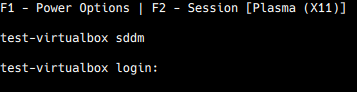

# TerminalStyleLogin
An SDDM theme that looks like a terminal

## Features
* Fully controllable by keyboard
* Allows power management
* Allows session selection (up to 9)
* Intended to imitate the appearance of a tty login
* Configurable font family/size and background/foreground colour

### Todo (perhaps)
* Add translations
* Add user selection via menu
* Allow selecting from more than 9 sessions

### Limitations
* No accessibility features!
* Virtual keyboard will not appear
* Mouse cursor is invisible
* Cannot be controlled by mouse

## Screenshots

Sample login prompt:

Sample power options menu:

Sample session menu:

## Configuration
* `fontFamily`: Name of the font to use ([reference](https://doc.qt.io/qt-5/qml-qtquick-textinput.html#font.family-prop))
* `fontSize`: The size of the font in points ([reference](https://doc.qt.io/qt-5/qml-qtquick-textinput.html#font.pointSize-prop))
* `foreground`: The colour of the font ([reference](https://doc.qt.io/qt-5/qml-color.html))
* `background`: The colour of the background (it will fill the entire screen) ([reference](https://doc.qt.io/qt-5/qml-color.html))

## Note for installation
If you install from this repository, first run the `scripts/build.sh` script to produce a `build` directory, and use the contents of this directory to install.

Alternatively, delete `Proxy.qml` and rename `RealProxy.qml` to `Proxy.qml`.

`Proxy.qml` contains dummy values and functions that are useful while testing with `sddm-greeter --test-mode` and will not work when in actual use.
